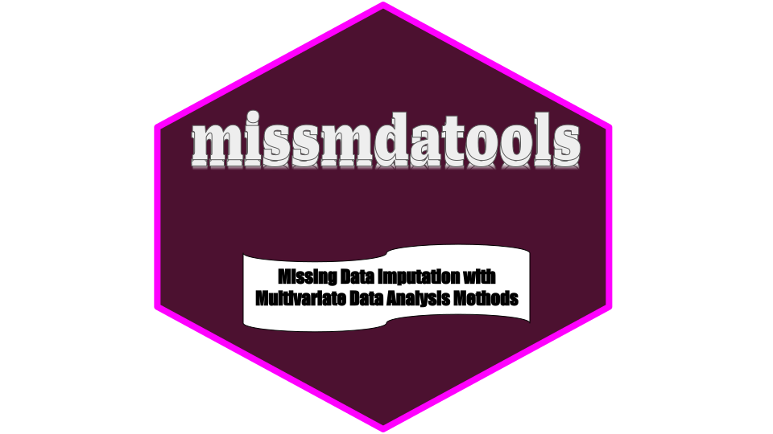

<center>
    
</center>

# missmdatools : Handling Missing Values with Multivariate Data Analysis

missmdatools is a python package for Handling Missing Values in Multivariate Data Analysis

## Why use missmdatools?

missmdatools performs multiple functions as :
* Estimate the number of components:
  * estim_ncpPCA: Estimate the number of dimensions for the Principal Components Analysis by cross - validation.
  * estim_ncpMCA: Estimate the number of dimensions for the Multiple Correspondence Multiple by cross - validation.
  * estim_ncpFAMD: Estimate the number of dimensions for the Factor Analysis of Mixed Data by cross - validation.
  * estim_ncpPCAMIX: Estimate the number of dimensions for the Principal Components Analysis of Mixed Data by cross - validation.
* Simple imputation :
  * imputePCA : impute dataset with Principal Components Analysis
  * imputeCA : impute contingency table with Correspondence Analysis
  * imputeMCA : impute categorical dataset with Multiple Correspondence Analysis
  * imputeFAMD : impute mixed dataset with Factor Analysis of Mixed Data
  * imputePCAMIX : impute mixed dataset with Principal Components Analysis of Mixed Data
  * imputeMFA : impute dataset with variables structured into groups of variables (continuous variables)
  * imputeMFAQUAL : impute dataset with variables structured into groups of variables (categoricals variables)
  * imputeMFAMIX : impute dataset with variables structured into groups of variables (mixed of groups)
* Multiple imputation :
  * MIPCA : Multiple Imputation with Principal Components Analysis
  * MIMCA : Multiple Imputation with Multiple Correspondence Analysis
  * MIFAMD : Multiple Imputation with Factor Analysis of Mixed Data
  * MIPCAMIX : Multiple Imputation with Principal Components Analysis of Mixed Data
  * MIMFA : Multiple Imputation with Multiple Factor Analysis (continuous variables)
  * MIMFAQUAL: Multiple Imputation with Multiple Factor Analysis for Qualitative variables
  * MIMFAMIX: Multiple Imputation with Multiple Factor Analysis of mixed Data/groups

## Installation

### Dependencies

missmdatools requires

```
Python >=3.10
```

### User installation

You can install missmdatools using pip:

```
pip install missmdatools
```

## References

> [missMDA: A Package for Handling Missing Values in Multivariate Data Analysis](https://www.jstatsoft.org/article/view/v070i01)

> [missMDA R package](https://cran.r-project.org/web/packages/missMDA/missMDA.pdf)

> [https://delladata.fr/imputation-donnees-manquantes-missmda/](https://delladata.fr/imputation-donnees-manquantes-missmda/)

> [MIMCA: multiple imputation for categorical variables with multiple correspondence analysis](https://link.springer.com/article/10.1007/s11222-016-9635-4)

## Author(s)

Duvérier DJIFACK ZEBAZE ([duverierdjifack@gmail.com](duverierdjifack@gmail.com))

